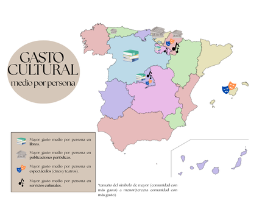

Aquí encontrarás los proyectos en los que he trabajado. Haz clic en cada proyecto para ver el análisis completo y el código.

Si estás buscando un analista de datos, no dudes en contactarme a través de [Linkedin](www.linkedin.com/in/emma-garcía-achondía-b0b7a7240) 
 
## Projects:

# Análisis Exploratorio del Consumo Cultural en España (2021-2023)

Este proyecto analiza el consumo cultural en las comunidades autónomas de España entre 2021 y 2023, con el objetivo de identificar patrones y relaciones entre variables sociodemográficas como la educación, la edad y los ingresos.

**Objetivo**
* Investigar cómo diferentes factores demográficos y económicos influyen en el consumo de productos y servicios culturales en España.

**Hipótesis evaluadas**
* Mayor nivel educativo implica mayor consumo cultural
* La edad media afecta al consumo cultural
* A mayores ingresos, mayor gasto en cultura

**Palabras clave** (Análisis Exploratorio de Datos, Consumo Cultural, España, Factores Socioeconómicos, Datos Públicos)

---
 

 
 
